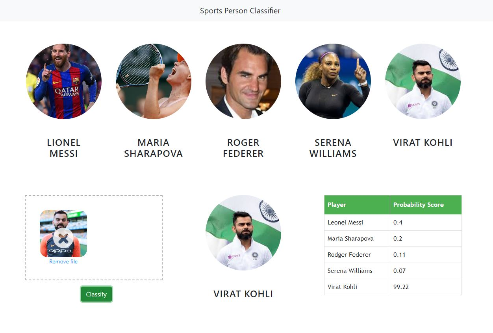

# 🏅 Sports Person Classifier

A machine learning web app that classifies sports celebrities from images using face and eye detection.

## 🚀 Live Demo
- **Frontend:** [Render](https://your-app.onrender.com)
- **Backend API:** [Hugging Face Spaces](https://tinegadev-sports-person-classifier.hf.space)

---

## 🧠 How It Works

1. User uploads an image via the browser
2. Frontend sends the image as base64 to the Flask API
3. OpenCV detects a face with **2 eyes** visible
4. A **Wavelet Transform** extracts features from the face
5. A trained **SVM / ML model** predicts the sports person
6. The result and probabilities are returned to the frontend

---

## 🏋️ Classified Athletes
- Virat Kohli
- Roger Federer
- Serena Williams
- Maria Sharapova
- Lionel Messi

---

## 🗂️ Project Structure

```
SportsPersonClassifier/
├── server/
│   ├── artifacts/
│   │   ├── celeb_model.pkl         # Trained ML model
│   │   └── class_dictionary.json  # Label mappings
│   ├── server.py                  # Flask API
│   ├── util.py                    # Image processing & prediction
│   ├── wavelet.py                 # Wavelet transform helper
│   ├── Dockerfile                 # Docker config for HuggingFace
│   └── requirements.txt
├── model/
│   └── ...                        # Training notebooks
├── ui/
│   └── ...                        # Frontend (HTML/CSS/JS)
└── README.md
```

---

## 🛠️ Tech Stack

| Layer | Technology |
|-------|-----------|
| Frontend | HTML, CSS, JavaScript |
| Backend | Python, Flask |
| ML | Scikit-learn, OpenCV, PyWavelets |
| Deployment (API) | Hugging Face Spaces (Docker) |
| Deployment (UI) | Render |

---

## 🔧 Run Locally

**1. Clone the repo:**
```bash
git clone https://github.com/YOUR_USERNAME/SportsPersonClassifier.git
cd SportsPersonClassifier
```

**2. Install dependencies:**
```bash
cd server
pip install -r requirements.txt
```

**3. Start the Flask server:**
```bash
python server.py
```

**4. Open `ui/index.html`** in your browser.

---

## 📦 API Usage

**Endpoint:** `POST /classify_image`

**Request:**
```
Content-Type: multipart/form-data
image_data: <base64 encoded image>
```

**Response:**
```json
[
  {
    "class": "virat_kohli",
    "class_probability": [12.0, 5.0, 75.0, 4.0, 4.0],
    "class_dictionary": {
      "virat_kohli": 0,
      "roger_federer": 1,
      ...
    }
  }
]
```

---

## 📄 License
MIT License